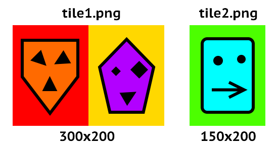
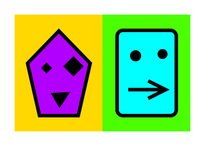

# `canvas-cleave`

Crop and tile images in Node.js with a HTML5 Canvas-based API. Doesn't do much, but does it reasonably fast!

```shell
$ npm install canvas-cleave
```

## How do I use this?

Say we have the following images:



And we want to merge them such that we have the right side of tile 1 side-by-side with tile 2. We can achieve this with the following code:

```typescript
// tile.ts (universal)
import { ICanvasImageSource, IDocument } from "canvas-cleave";

// limit document features to what is supported by both browsers and canvas-cleave
declare const document: IDocument;

export function tile(tile1: ICanvasImageSource, tile2: ICanvasImageSource) {
  const canvas = document.createElement("canvas");
  canvas.width = 300;
  canvas.height = 200;
  // our images don't have alpha so we can optimize performance by making our canvas context without alpha as well
  const ctx = canvas.getContext("2d", { alpha: false });

  const WIDTH = 150; // our tile width
  const HEIGHT = 200; // our tile height

  // draw the right half of tile 1 to the left side of our canvas
  ctx.drawImage(tile1, 150, 0, WIDTH, HEIGHT, 0, 0, WIDTH, HEIGHT);
  // draw tile 2 in its entirety to the right side of our canvas
  ctx.drawImage(tile2, 150, 0);

  return canvas;
}
```

```typescript
// main.ts (node)
import { NodeDocument } from "canvas-cleave";
import { loadImage, saveImage } from "./helpers";
import { tile } from "./tile";

// insert canvas-cleave's document shim into the global context so our tile function works
NodeDocument.inject();

async function main() {
  const tile1 = await loadImage("./tile1.png");
  // -> NodeImageBitmap { width: 300, height: 200 }
  const tile2 = await loadImage("./tile2.png");
  // -> NodeImageBitmap { width: 150, height: 200 }
  const canvas = tile(tile1, tile2);
  await saveImage("./tiles.png", canvas);
}

main();
```

```typescript
// helpers.ts
import sharp from "sharp";
import { NIRawImage, NodeCanvas, NodeImageBitmap } from "canvas-cleave";

const LOAD_IMAGE_OPTS = {
  resolveWithObject: true as true
};

function isRawImage(input: any): input is NIRawImage {
  if (
    input.info &&
    typeof input.info.width === "number" &&
    typeof input.info.height === "number" &&
    typeof input.info.channels === "number" &&
    input.data instanceof Buffer &&
    input.data.length ===
      input.info.width * input.info.height * input.info.channels
  )
    return true;
  return false;
}

export async function loadImage(source: string): Promise<NodeImageBitmap> {
  const rawImage = (await sharp(source)
    .raw()
    .toBuffer(LOAD_IMAGE_OPTS)) as NIRawImage;
  const bitmap = new NodeImageBitmap(rawImage);
  return bitmap;
}

export async function saveImage(
  target: string,
  rawImage: NIRawImage | NodeImageBitmap | NodeCanvas
): Promise<sharp.OutputInfo> {
  if (!isRawImage(rawImage)) rawImage = rawImage.toRawImage();
  const { data, info } = rawImage;
  return await sharp(data, { raw: info })
    .png()
    .toFile(target);
}
```

And by running the function we have our final result:



## So what exactly can I do with this?

A minimal shim for Node.js that enables you to use the following HTML5 Canvas image drawing methods (with additional limitations - see below for details).

```typescript
CanvasRenderingContext2D.drawImage(
  image: Image, // Image instance
  dx: number, // destination X
  dy: number // destination Y
): void;

CanvasRenderingContext2D.drawImage(
  image: Image, // Image instance
  sx: number, // source X
  sy: number, // source Y
  sWidth: number, // source width
  sHeight: number, // source height
  dx: number, // destination X
  dy: number, // destination Y
  dWidth: number, // destination width
  dHeight: number // destination height
): void;
```

To achieve this, this module contains small shims for `Image`, `Canvas`, `ImageData` and `CanvasRenderingContext2D`. [See full API documentation for details on what exactly is implemented](https://github.com/Daiz/canvas-cleave/blob/master/docs/canvas-cleave.md), though for cross-environment purposes you are most likely interested in the [full interfaces that `canvas-cleave` provides.](https://github.com/Daiz/canvas-cleave/blob/master/docs/canvas-cleave.md#interfaces)

## So what are those `drawImage` limitations you mentioned?

- Resizing isn't supported. `sWidth` and `sHeight` must match `dWidth` and `dHeight`.

## Loading and saving images

To keep things dependency-free, `canvas-cleave` does not include any means to actually load image files from disk or anywhere else by itself. It is recommended that you use [sharp](https://github.com/lovell/sharp) for this purpose - see the `helpers.js` above to get started - generally speaking, the various key functions in the library can take `NIRawImage` as input, which is convenienty what sharp provides with it raw metadata-including output.

## Why does this even exist?

I have a lot of image tiles that I need to assemble and reassemble in both backend (Node) and frontend (browser). I built this package so I can use the same image manipulation code in both the browser and Node, without having to rely on heavy native code based solutions like `node-canvas` or other slow and clunky solutions (don't even ask).
